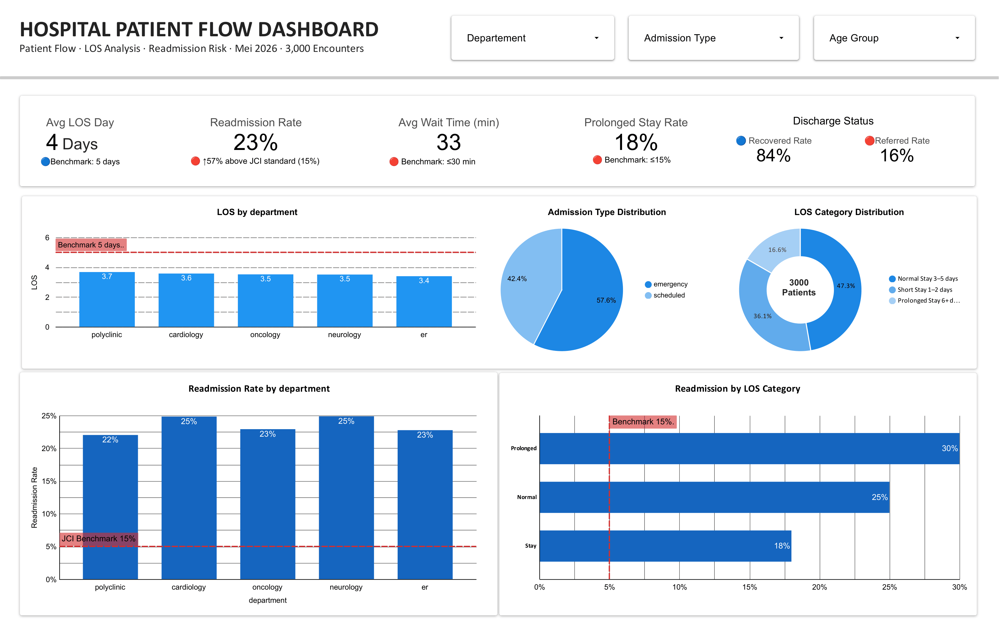
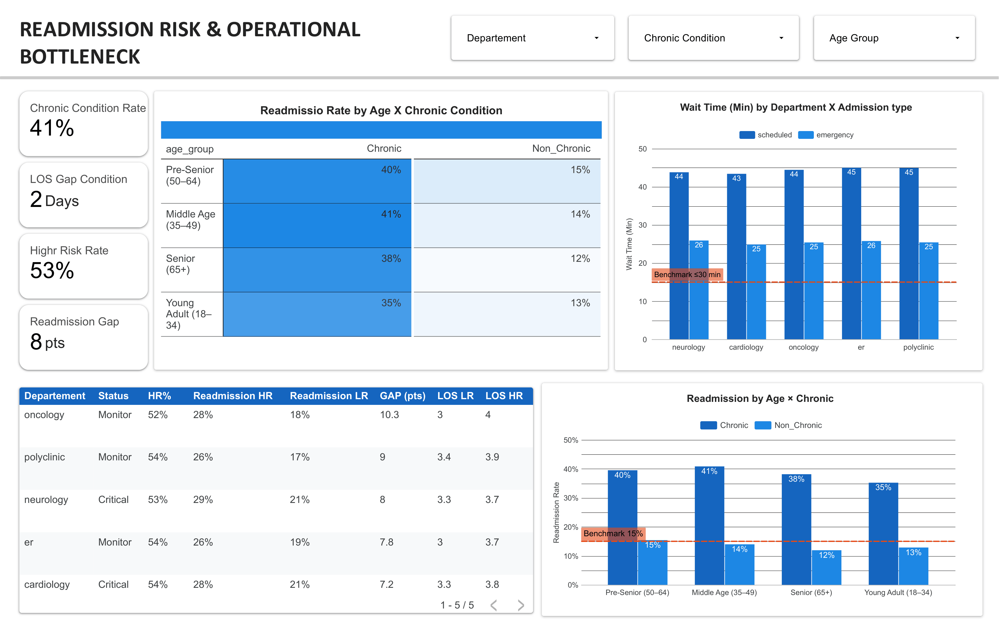

# 🏥 Hospital Patient Flow Analysis

### *From Admission to Readmission — Uncovering Hidden Patterns in Hospital Data*

---

## 🔎 Overview

> Analyzing **3,000 patient encounters** across 5 hospital departments to identify readmission risk patterns, LOS bottlenecks, and operational inefficiencies — enabling evidence-based decisions for hospital management.

**Tools used:**
`Python` · `SQL` · `Pandas` · `Seaborn` · `Google Sheets` · `Looker Studio`

---

## 🚨 Key Findings
📍 Readmission Rate → 23.5% ⚠️ JCI Benchmark: ≤15%
📍 Prolonged Stay → 17.6% ⚠️ Benchmark: ≤15%
📍 Chronic Readmission → 35–41% 🔴 vs Non-Chronic: 12–15%
📍 Scheduled Wait Time → 44 min ⚠️ Benchmark: ≤30 min
📍 HR vs LR Gap → +10.3 pts 🔴 Oncology — largest gap

---

---

## 💡 Insights at a Glance

| # | Insight | Impact |
|---|---------|--------|
| 1 | Chronic patients aged **35–49** have the **highest readmission rate (40.8%)** — surpassing seniors 65+ | 🔴 Critical |
| 2 | Prolonged Stay patients cost **2.5× more** with **30.2% readmission** and lowest satisfaction | 🔴 Critical |
| 3 | Oncology shows the **widest HR vs LR readmission gap** (10.3 pts) across all departments | 🔴 Critical |
| 4 | Scheduled patients wait **18–20 min longer** than emergency — consistent across all 5 departments | 🟡 Systemic |

---

## 📊 Dashboard Preview

> 🔗 [**View Interactive Dashboard →**](https://datastudio.google.com/reporting/d429c6fb-be3b-461d-bf35-f92af18e4eea)

| Page 1 — Patient Flow Overview | Page 2 — Risk & Bottleneck |
|---|---|
|  |  |

---

## ⚠️ Disclaimer

Dataset is synthetic ([Kaggle — Healthcare Patient Journey](https://www.kaggle.com/datasets/prasad22/healthcare-dataset)) and intended for portfolio demonstration only.

---

**Author : Ananda Anugrah**

*"Built with curiosity, structured with data, communicated with clarity."*

